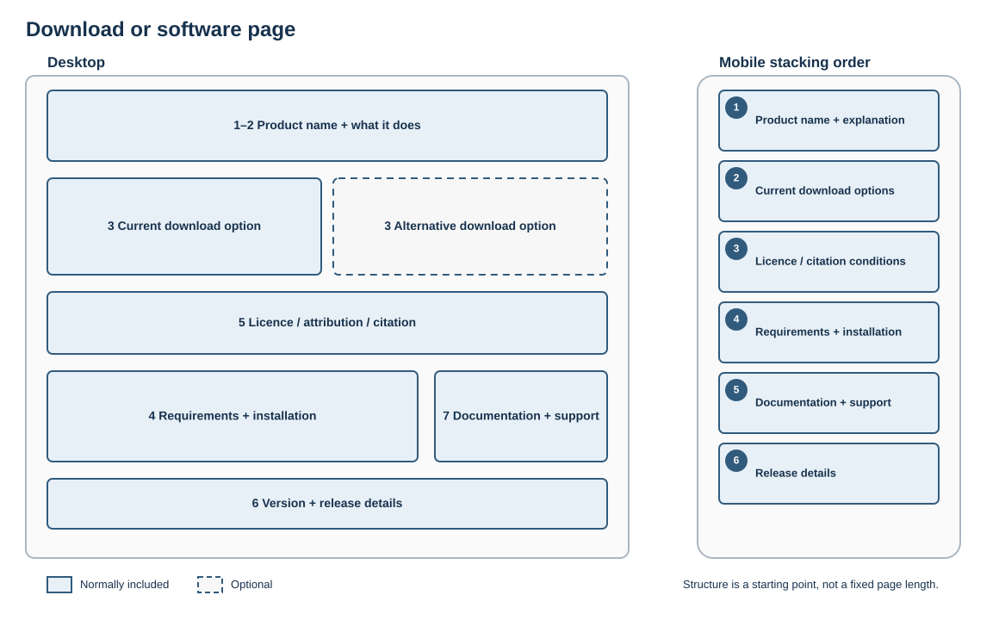

# Download or software page

## Best for

Helping visitors select and obtain the right software, dataset, document or version.

## Skeleton layout

Current downloads and their conditions stay together and precede installation help and release history.

## Starter structure

1. Product or resource name
2. Short explanation of what it does
3. Current download options with differences made explicit
4. Requirements and installation guidance
5. Licence, attribution or citation conditions beside the relevant download
6. Version and release details
7. Documentation, support and contact

Downloading is the primary journey. Do not bury current files beneath release history or repeat vague “here” links.
