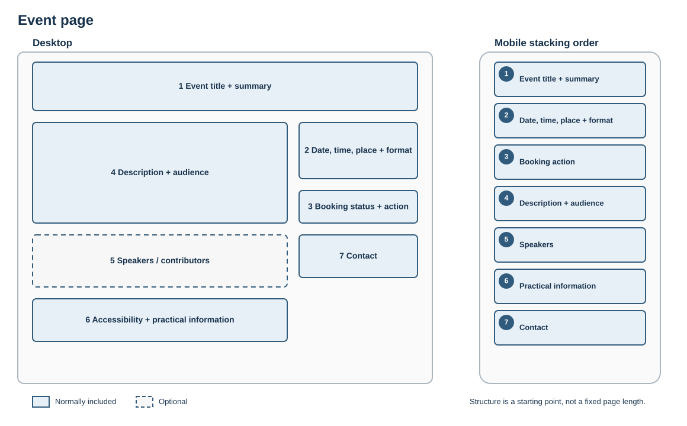

# Event page

## Best for

Helping visitors decide whether to attend and complete the next step.

## Skeleton layout

On mobile, essential event details and the booking action move ahead of the longer description.

## Starter structure

1. Event title and short summary
2. Date, time, location and format
3. Booking status and primary action
4. Description and intended audience
5. Speakers or contributors
6. Accessibility and practical information
7. Contact

Keep booking information and time-sensitive changes prominent and assign an owner for updates.
