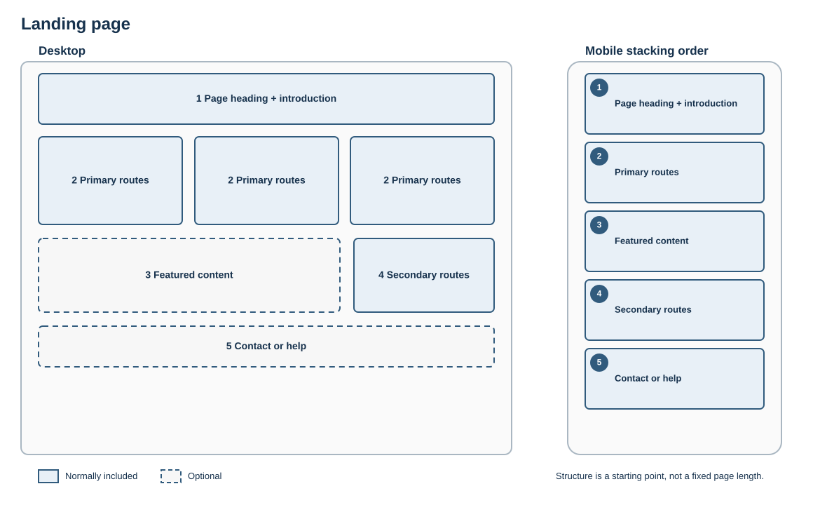

# Landing page

## Best for

A genuine entry point where visitors need to choose among several substantial sections or tasks.

## Skeleton layout

Primary routes come before promotional material. The mobile layout preserves that priority rather than following desktop position alone.

## Starter structure

1. Page heading and concise introduction
2. Primary routes or tasks
3. Featured or time-sensitive content, if justified
4. Secondary routes
5. Contact or help

Do not turn every ordinary content page into a landing page. Keep choices distinct, limited and ordered by user importance.
