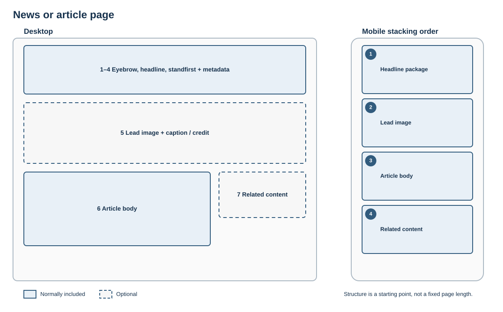

# News or article page

## Best for

Dated editorial content with an identifiable subject and publication context.

## Skeleton layout

The article body uses a readable line length. Metadata stays with the headline and related material remains secondary.

## Starter structure

1. Optional eyebrow or content type
2. Headline
3. Standfirst
4. Publication date and relevant metadata
5. Lead image with caption or credit where required
6. Article body
7. Related content

Keep metadata distinct from the headline. Use meaningful subheadings for longer articles.
