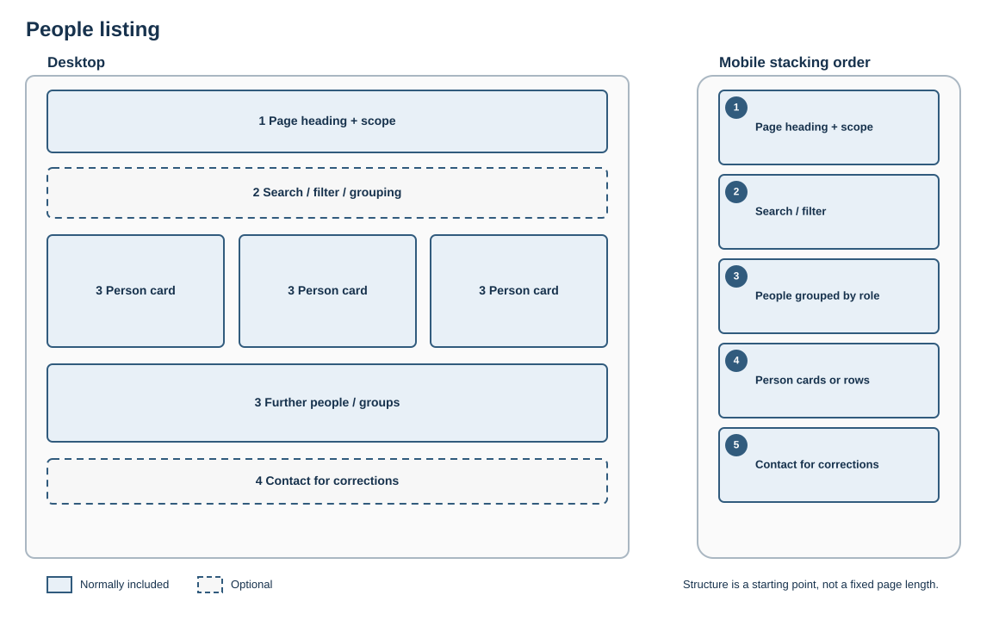

# People listing

## Best for

Finding members of a department, group, team or project.

## Skeleton layout

People remain grouped by meaningful role or relationship. Cards become full-width rows where needed on small screens.

## Starter structure

1. Page heading and explanation of who is included
2. Search, filter or grouping where the list warrants it
3. Consistent person cards or rows
4. Contact route for corrections or general enquiries

Use the same fields consistently. On mobile, cards or rows must stack without truncated text or horizontal scrolling.
