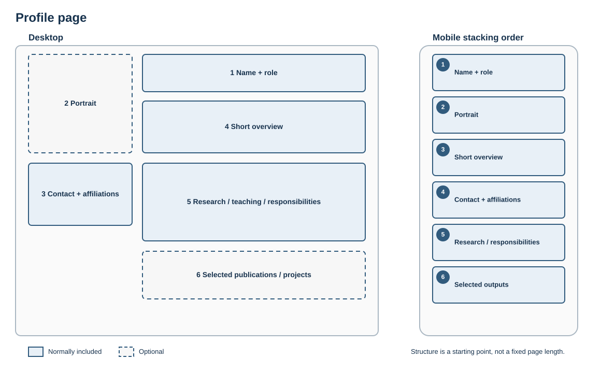

# Profile page

## Best for

Presenting one person's role, expertise, biography and relevant outputs.

## Skeleton layout

The desktop layout may place the portrait and contact details beside the main narrative. On mobile, the person's identity and overview remain first.

## Starter structure

1. Name and role
2. Portrait, where available and useful
3. Contact and affiliations
4. Short overview
5. Research, teaching or responsibilities
6. Selected publications, projects or links

Prioritise what visitors need to know; avoid turning the page into an unstructured CV.
