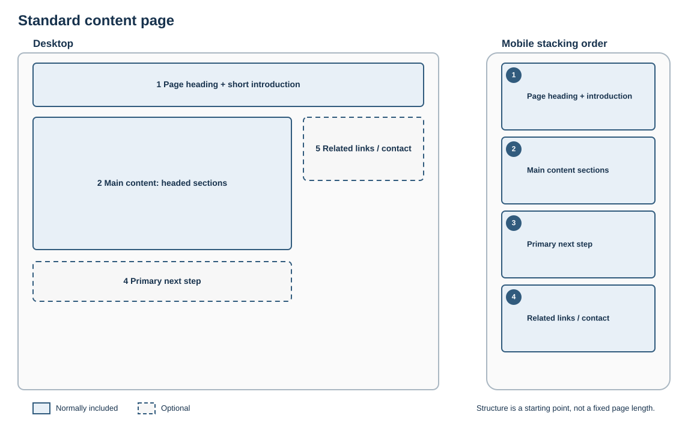

# Standard content page

## Best for

Policies, guidance, service information and focused explanatory content.

## Skeleton layout

The main explanation uses a readable content width. Supporting links follow the primary content on smaller screens.

## Starter structure

1. Page heading
2. Short introduction stating scope and audience
3. Main content in logically headed sections
4. Primary next step, where one exists
5. Related links or contact details

Keep navigation and promotional content secondary to the explanation.
