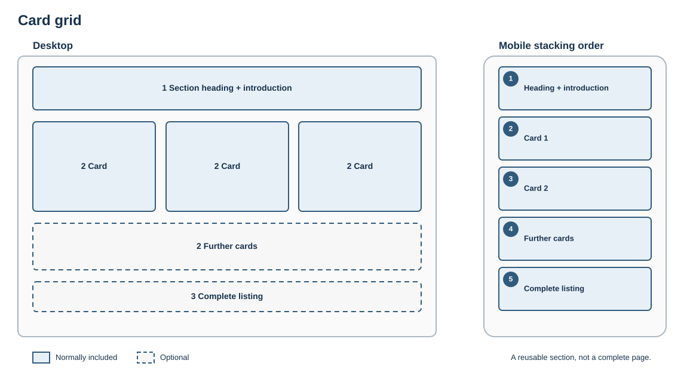

# Card grid

## Purpose

Help visitors compare and choose among a small set of equivalent destinations.

## Skeleton layout

Cards share the same hierarchy and fields. The desktop row becomes a single ordered sequence on narrow screens.

## Suggested structure

1. Section heading and optional introduction
2. Two to six cards with consistent fields
3. Optional single link to a complete listing

## Rules

- All cards should represent the same kind of choice.
- Keep titles concise and summaries comparable.
- Avoid making an entire long card an ambiguous link.
- Define the stack order for narrow screens; do not force a desktop row onto mobile.

## Fresco examples

Screenshots and links to tested Fresco examples will be added here.
