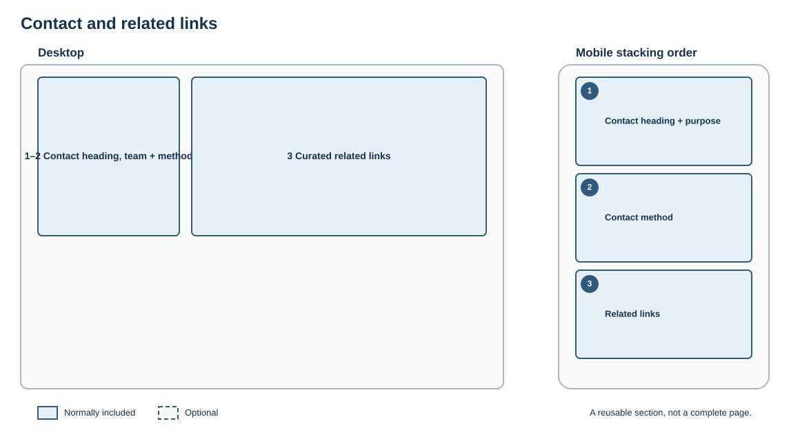

# Contact and related links

## Purpose

End a journey with a clear route to further information or help.

## Skeleton layout

Contact information remains distinct from onward reading. On mobile, the help route comes before related links.

## Suggested structure

1. Contact heading and named team or service
2. Relevant contact method
3. Small, curated set of related links

## Rules

- State what the contact can help with.
- Prefer role-based contact details where appropriate.
- Do not reproduce the site's full navigation.
- Keep related links specific to the current page.

## Fresco examples

Screenshots and links to tested Fresco examples will be added here.
