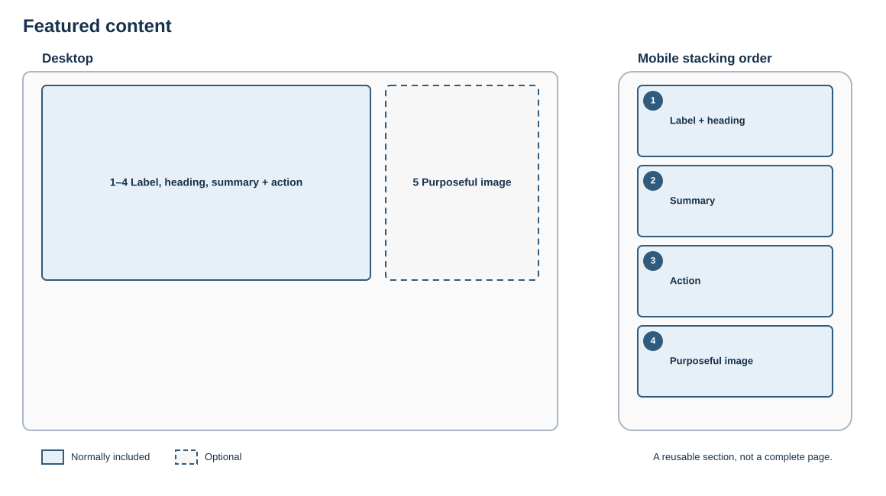

# Featured content

## Purpose

Give one piece of content clear prominence without turning every item into a competing feature.

## Skeleton layout

Text carries the meaning; the image is optional and must support it. Desktop image position may vary, but the mobile reading order must remain deliberate.

## Suggested structure

1. Optional eyebrow or content-type label
2. Descriptive heading
3. Short summary
4. One clear action
5. Optional purposeful image

## Rules

- Feature one item at a time.
- Do not use this pattern for routine navigation.
- The heading and summary must explain why the item matters.
- Avoid text embedded in the image.

## Fresco examples

Screenshots and links to tested Fresco examples will be added here.
