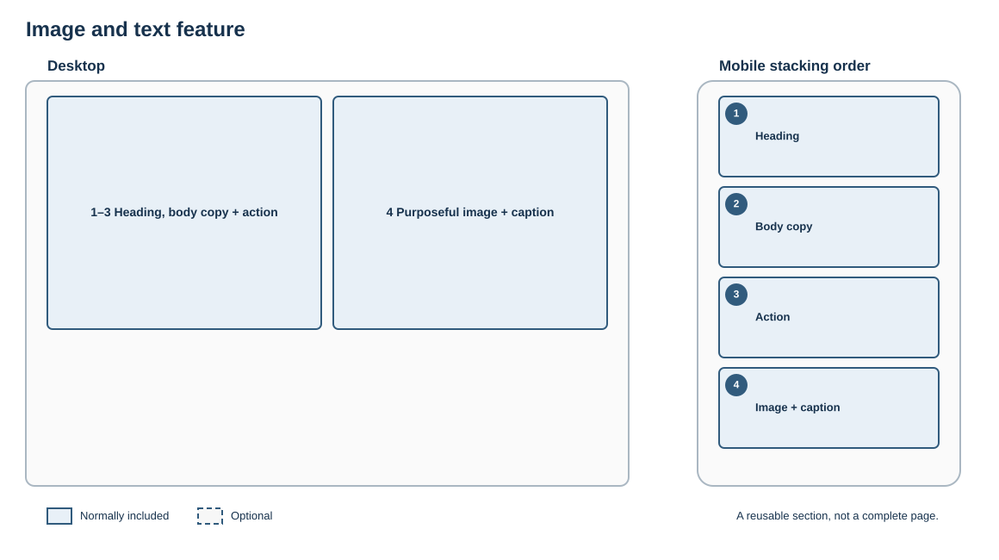

# Image and text feature

## Purpose

Use an image to explain, evidence or humanise content alongside a focused piece of text.

## Skeleton layout

The image and text may sit side by side on wide screens. Mobile order follows meaning rather than whichever column happened to appear first on desktop.

## Suggested structure

1. Heading
2. Short body copy
3. Optional action
4. Image with alternative text or caption as appropriate

## Rules

- The image must have a job; omit it if it is only filling space.
- Preserve a logical reading order when the layout stacks.
- Do not alternate image position repeatedly without a content reason.
- Crop and focal-point behaviour must work at all supported widths.

## Fresco examples

Screenshots and links to tested Fresco examples will be added here.
