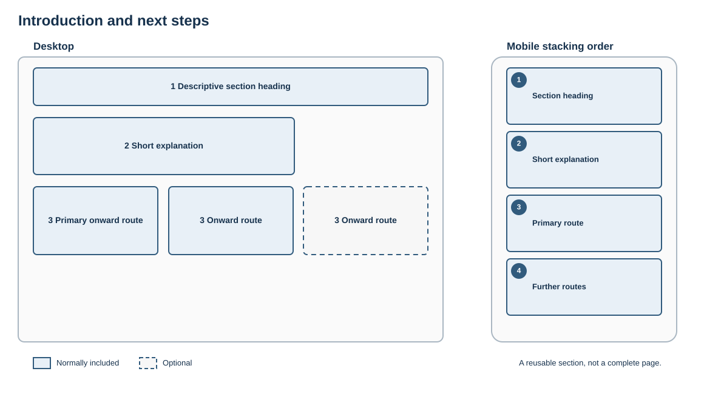

# Introduction and next steps

## Purpose

Help visitors understand what the page or section offers, then choose a small number of clear onward routes.

## Skeleton layout

The explanation establishes context before the links. On small screens, routes stack in their intended priority order.

## Suggested structure

1. Descriptive section heading
2. Short explanatory paragraph
3. Two to four links, calls to action or cards

## Rules

- Put the most important route first.
- Use parallel choices; do not mix unrelated links merely to fill a row.
- Use descriptive labels that make sense out of context.
- On mobile, stack items in the intended reading order.

## Fresco examples

Screenshots and links to tested Fresco examples will be added here.
