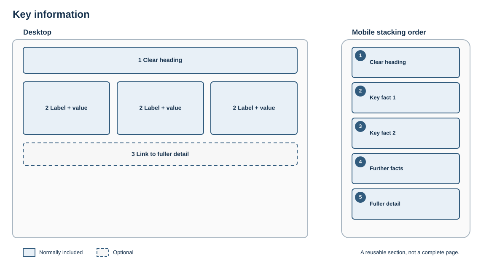

# Key information

## Purpose

Surface the practical facts visitors are most likely to scan for, such as dates, costs, eligibility, location or availability.

## Skeleton layout

Facts may form a compact row on wide screens but become individually labelled items on mobile.

## Suggested structure

1. Clear heading
2. Short list, definition list or compact set of key facts
3. Optional link to fuller detail

## Rules

- Use labels consistently.
- Keep values concise and current.
- Do not use visual statistics for ordinary prose.
- Assign an owner and review date to time-sensitive information.

## Fresco examples

Screenshots and links to tested Fresco examples will be added here.
